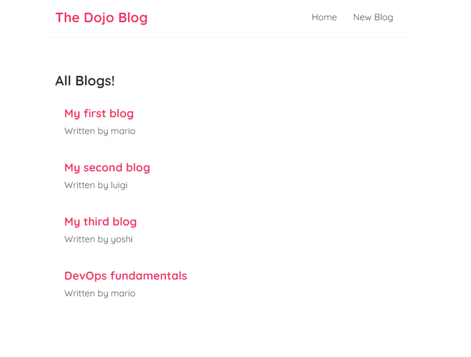

# Simple-Blog-App-By-Modern-React



A minimalistic blog app built using modern React and React Router, allowing users to create and view blog posts.

## Table of Contents

- [Demo](#demo)
- [Features](#features)
- [Getting Started](#getting-started)
- [Usage](#usage)
- [Folder Structure](#folder-structure)
- [Contributing](#contributing)

## Demo

You can see a live demo of the Simple Blog App here: [Live Demo](#insert-demo-link-here)

## Features

- Create new blog posts.
- View individual blog post details.
- Clean and responsive design.
- Routing with React Router.
- 404 error handling for unknown routes.

## Getting Started

To get started with this project, follow these steps:

1. **Clone the repository:**

   ```
   git clone https://github.com/Anonto050/Simple-Blog-App-Using-Modern-React.git
   ```

2. **Install dependencies:**

   ```shell
   cd Simple-Blog-App-Using-Modern-React
   npm install
   ```

3. **Run the JSON server for data:**

   Before running your React app, you need to start the `json-server` to serve the blog data. Open a new terminal window, navigate to your project directory, and run the following command:

   ```shell
   npx json-server --watch data/db.json --port 8000
   ```

   This will start the JSON server and make the blog data accessible at `http://localhost:8000`.

4. **Run the development server for your React app:**

   In a separate terminal window, make sure you're still in the project directory and run:

   ```shell
   npm run start
   ```

   This will start the development server for your React app, and you can access the app at `http://localhost:3000` in your web browser.

## Usage

1. **Homepage:**

   The homepage displays a list of existing blog posts fetched from the JSON server. Click on a blog post to view its details

2. **Create a Blog Post:**

   Click on the "Create" link in the navigation bar to create a new blog post. Fill in the title and content of your blog post and submit it. The new blog post will be added to the db.json file.

3. **View Blog Details:**

   Click on a blog post from the homepage to view its details. You can see the full content of the blog post.

4. **404 Not Found:**

   If you navigate to an unknown URL, you will be redirected to a 404 error page.

## Folder Structure

The project structure is organized as follows:

- `src/` - Contains the source code for the application.
  - `App.js` - Main application component that sets up routing.
  - `Navbar.js` - Navigation bar component.
  - `Home.js` - Homepage component.
  - `Create.js` - Component for creating new blog posts.
  - `BlogDetails.js` - Component for displaying individual blog post details.
  - `NotFound.js` - 404 error page component.
- `index.js` - Entry point of the application.
- `index.css` - Global CSS styles.
- `reportWebVitals.js` - Performance monitoring.

## Contributing

Contributions to this project are welcome! If you find a bug or have an idea for an improvement, please open an issue or submit a pull request.


---
